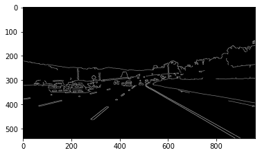
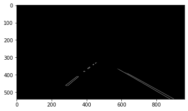

# **Finding Lane Lines on the Road** 

**Finding Lane Lines on the Road**

The goals / steps of this project are the following:
* Make a pipeline that finds lane lines on the road
* Reflect on your work in a written report

---

### Reflection

### 1. Describe your pipeline. As part of the description, explain how you modified the draw_lines() function.

My pipeline consisted of 5 steps.  
- Read image then convert to grayscale
- use gaussain blur with `5x5` kernel to smooth the image
- use canny to detect edge and conner with low_threshold = `50`, high_threshold = `150`  
  
- crop result of canny using vertices `[150, img.shape[0]], [450, 330], [500, 330], [950, img.shape[0]]`  
  
- Finally use hough lines to find lane

In order to draw a single line on the left and right lanes, I modified the draw_lines() function by 
- First I separate the left and right lanes by determine the sloop if sloop more than zero it is right lanes else is left lanes then collect the coordinate (x1,y1),(x2,y2) into lists(left, right) according to aformention condition and I do filter out the coordinate that more than or less than 480 depend on which side it belong to reduce noise.
- Second I use list of x, y to find slope and bias by using `numpy.polyfit`
- Now I have `slope`, `bias` and `y = [img.shape[0], 330]` which are lowest and highest y of vertices that I uses.  
So `x = y-bias/slope`. Apply to both left and right lanes, I will have two long lines for both lanes.  

---

### 2. Identify potential shortcomings with your current pipeline

One potential shortcoming would be what would happen when both lanes have slope to the same way like when the car turn left I think both lanes will have slope less than zero and since my code seperate side that way. 

Another shortcoming could be when there are curve road like the optional challenge even if I can tune parameter to detect lane accuracy my draw_lines still cannot handle curve lanes

There are many more shortcoming like when the change lane or the car are not on center of the image.

---

### 3. Suggest possible improvements to your pipeline

I alway suffer with the noise that will affect the draw line. Right now I use simple way to handle it but It not rebust at all. So I think there should have another solution to handle this problem and make my pipeline more robust. Another improvements should to able to handle more situation like turn left, right or intersection.